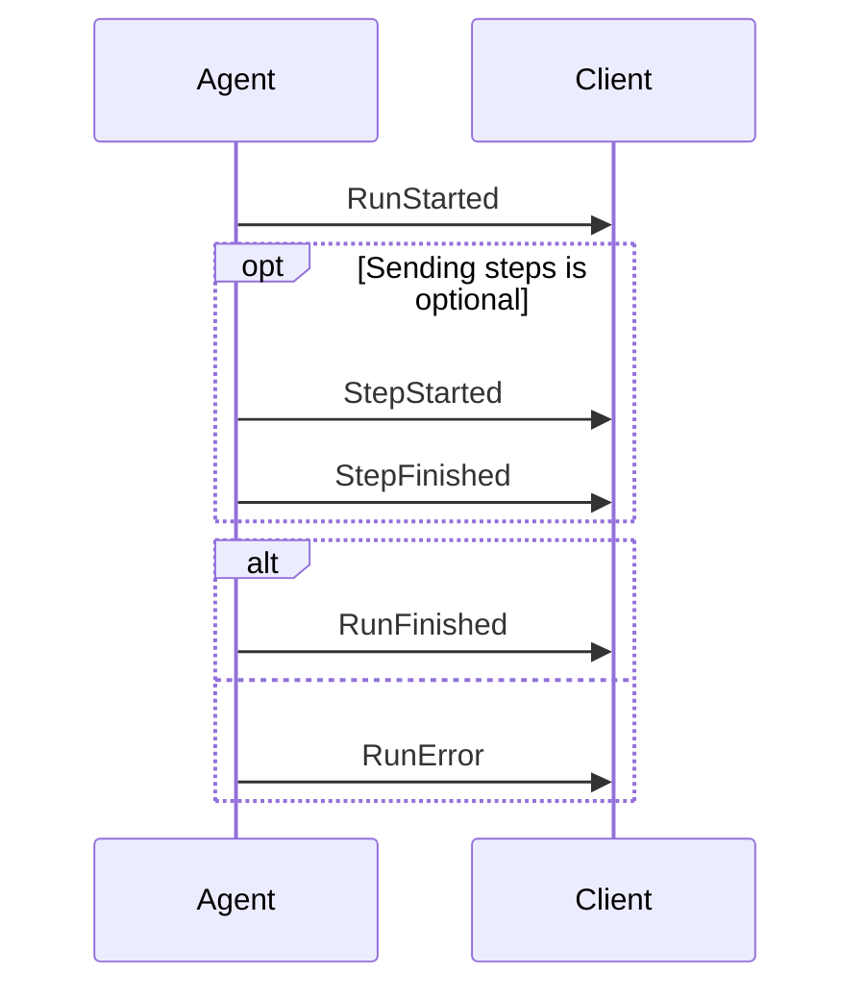

# Digest — How CopilotKit / AG-UI specifies a protocol

**Research question:** the owner likes "the CopilotKit (AG-UI) protocol style". What *is* that style,
mechanically, and what of it transfers to `parley-design` (doctrine) and `parley-design-check`
(enforcement)?

**Method:** shallow-cloned both repos + read the canonical public docs.

| What | Where I read it |
|---|---|
| CopilotKit client/runtime monorepo | `/private/tmp/claude-501/-Volumes-My-Shared-Files-AI-WORKSPACE-parley-deck/5dc331bd-5ddf-45e0-b6c2-d519d8c05128/scratchpad/research/copilotkit` (github.com/CopilotKit/CopilotKit) |
| **AG-UI protocol repo** (the actual spec) | `/private/tmp/claude-501/-Volumes-My-Shared-Files-AI-WORKSPACE-parley-deck/5dc331bd-5ddf-45e0-b6c2-d519d8c05128/scratchpad/research/ag-ui` (github.com/ag-ui-protocol/ag-ui) |
| Canonical docs site | https://docs.ag-ui.com — index at https://docs.ag-ui.com/llms.txt |

> **FACT (important, and it shapes everything below):** the protocol does **not** live in the
> CopilotKit repo. CopilotKit is a *client* of AG-UI. Grepping CopilotKit for AG-UI material yields
> only consumer docs (`dev-docs/architecture/ARCHITECTURE.md`, `skills/copilotkit-agui/SKILL.md`).
> The normative material is in the separate `ag-ui-protocol/ag-ui` repo. **The protocol was extracted
> into its own repo, its own docs domain, and its own npm/PyPI namespaces — separate from the vendor
> that wrote it.** That separation *is* the vendor-neutrality mechanism.

---

## 1. FACT — the exact structure of the spec

### 1.1 Docs navigation (normative order)

Source of truth for the sidebar: `ag-ui/docs/docs.json` (Mintlify config, 227 lines). Two tabs.

**Tab "Documentation"**, 5 groups, in this order:

1. **Get Started** — `introduction`, `agentic-protocols`, then a nested **Quickstart** group
   (`quickstart/applications` → *Build integrations*: `quickstart/introduction`, `quickstart/server`,
   `quickstart/middleware` → `quickstart/clients`)
2. **Concepts** — exactly this order (`docs.json` lines 39-53):
   `concepts/architecture`, `concepts/events`, `concepts/agents`, `concepts/middleware`,
   `concepts/messages`, `concepts/reasoning`, `concepts/state`, `concepts/interrupts`,
   `concepts/serialization`, `concepts/tools`, `concepts/capabilities`,
   `concepts/generative-ui-specs`
3. **Draft Proposals** — `drafts/overview`, `drafts/generative-ui`, `drafts/meta-events`
4. **Tutorials** — `tutorials/cursor`, `tutorials/debugging`
5. **Development** — `development/updates`, `development/roadmap`, `development/contributing`,
   `talk-to-us`

**Tab "SDKs"** — TypeScript / Python / .NET, each split into `core` (types, events) and
`client`/`hosting`. Community SDK docs (Go, Java, Kotlin, Rust, Ruby, Dart) exist as `.mdx` files in
`docs/sdk/` but are *not* wired into `docs.json` navigation.

**The load-bearing ordering decision:** `architecture` → `events` → *everything else*. The reader
gets the mental model, then the complete typed vocabulary, then each subsystem. Concepts are ordered
"what you cannot avoid" → "what you opt into" (`capabilities` and `generative-ui-specs` last).

### 1.2 The anatomy of the core spec page

`ag-ui/docs/concepts/events.mdx` — 827 lines, 12 H2 sections in this order (verified via
`grep -n "^#\{1,4\} "`):

```
##  Event Types Overview          <- a 7-row category table, informative
##  Base Event Properties         <- 3-row table: type / timestamp / rawEvent
##  Lifecycle Events              <- prose + mermaid sequence diagram + normative sentence
##  Text Message Events
##  Tool Call Events
##  State Management Events
##  Activity Events
##  Special Events                <- Raw, Custom  (the extension points)
##  Reasoning Events
##  Deprecated Events             <- <Warning> + old→new mapping table
##  Draft Events                  <- inline DRAFT badge + link to /drafts/*
##  Event Flow Patterns           <- 3 named reusable patterns, informative
##  Implementation Considerations <- 4 bullets, advisory
```

**Every single event gets an identically-shaped entry** (`### RunStarted`, lines 76-93):

1. H3 = the **PascalCase** event name
2. one-sentence "Signals the start of an agent run."
3. one paragraph of *rationale* — **why the event exists and what the frontend does with it**
4. a two-column property table: `| Property | Description |`

That four-part shape never varies across 33 events. It is the single most copyable thing in the
whole spec.

**Normative vs informative is signalled by sentence form, not by a keyword convention.** Examples of
the normative sentences, quoted exactly:

- "The `RunStarted` and either `RunFinished` or `RunError` events are **mandatory**, forming the
  boundaries of an agent run. Step events are optional and may occur multiple times within a run."
  (`events.mdx` lines 73-75)
- "Every run terminates with either `RunFinished` or `RunError`." (`events.mdx` line 95)
- "After a `RunError` event, no further processing will occur in this run." (`events.mdx` ~line 125)
- "Events should be processed in the order they are received" / "Implementations should be resilient
  to out-of-order delivery" (`events.mdx` §Implementation Considerations)

> **FACT:** AG-UI does **not** use RFC 2119 uppercase MUST/SHOULD/MAY. `grep -n "MUST\|SHOULD\|MAY"`
> over `docs/concepts/interrupts.mdx` returns **zero** hits. It uses lowercase "must"/"should" in
> numbered rule lists instead. See §7 — this is a weakness, not a strength.

### 1.3 The best-specified page in the repo: `interrupts.mdx`

`ag-ui/docs/concepts/interrupts.mdx` is the template to steal. Its H2 order:

```
## Lifecycle
## Run outcomes
## The Interrupt type
## Resuming a run
## Contract rules          <- 8 NUMBERED, NAMED rules
## State at the interrupt boundary
## Error handling          <- exhaustive list of conditions that produce RunError
## Reason taxonomy
### Core values           <- 3 spec-defined values in a table
### Custom reasons        <- namespacing rule + reserved prefix
### Client routing        <- what a client MUST do with an unknown value
## Tool-bound interrupts
### Approve with edits
## Examples               <- 4 worked, complete examples
## Framework integrations
## Related
```

The **Contract rules** section (lines 112-133) is 8 rules, each with a **bolded short name** then the
rule. Verbatim samples:

> 1. **Same thread.** Resume requests must use the same `threadId` as the interrupted run.
> 3. **Cover all open interrupts.** A single `resume` array must address every open interrupt from
>    the interrupted run. Partial resumes are not supported.
> 5. **Idempotency.** A resume with the same `(threadId, interruptId, status, payload)` must be safe
>    to replay.

And the extension policy, verbatim (lines 159-183):

> `reason` is a required string. A small set of core values is spec-defined; any other string is a
> valid extension.
> … Agents should namespace custom reasons as `<framework>:<name>` (for example,
> `langgraph:database_modification`, `mastra:workflow_suspend`). **The `core:` prefix is reserved for
> future spec additions.**
> … For unknown reasons, **clients must not error.** Render from `message`, `responseSchema`, and
> `metadata`.

That last triple — *reserved namespace + vendor-prefixed extensions + "unknown values must not
error"* — is the whole forward-compatibility story in three sentences.

---

## 2. FACT — how artifacts are typed, and where the single source of truth lives

**The single source of truth is a Zod schema file, not prose and not JSON Schema:**
`ag-ui/sdks/typescript/packages/core/src/events.ts` (485 lines).

Everything else is derived from it:

```ts
// events.ts:12-61 — the closed vocabulary, 33 members
export enum EventType { TEXT_MESSAGE_START = "TEXT_MESSAGE_START", … }

// events.ts:63-69 — the open base
export const BaseEventSchema = z.object({
  type: z.nativeEnum(EventType),
  timestamp: z.number().optional(),
  rawEvent: z.any().optional(),
}).passthrough();

// events.ts:71-76 — every event = BaseEventSchema.extend({ type: z.literal(...) , …fields })
export const TextMessageStartEventSchema = BaseEventSchema.extend({
  type: z.literal(EventType.TEXT_MESSAGE_START),
  messageId: z.string(),
  role: TextMessageRoleSchema.default("assistant"),
  name: z.string().optional(),
});

// events.ts:326-360 — the closed union, discriminated on `type`
export const EventSchemas = z.discriminatedUnion("type", [ …33 schemas… ]);

// events.ts:449+ — types are INFERRED, never hand-written
export type TextMessageStartEvent = z.infer<typeof TextMessageStartEventSchema>;
```

Design decisions worth naming:

| Decision | Evidence | Why it matters |
|---|---|---|
| **Closed discriminant, open payload** | `z.nativeEnum(EventType)` + `.passthrough()` (`events.ts:65,69`) | You cannot invent an event *type*, but you can add fields and they survive round-trips. Forward compat for free. |
| **Types derived from runtime validators** | `z.infer<>` on every line 449-486 | The validator and the type can never disagree. One artifact, two consumers (compile-time + runtime). |
| **Ergonomic constructors are separate** | `core/src/event-factories.ts` (367 lines) | Spec file stays pure; DX helpers live next door. |
| **Two extension escape hatches, both typed** | `RawEventSchema { event: any, source?: string }` and `CustomEventSchema { name: string, value: any }` (`events.ts:213-223`) | "Wrap a foreign thing" vs "carry my own thing" are *different* needs and get *different* events. |
| **Second binary encoding** | `packages/proto/src/proto/{events,types,patch}.proto` | Wire format is pluggable; the schema is not. |

**Cross-language parity is hand-mirrored, not generated.** `sdks/python/ag_ui/core/events.py` restates
the same 33 enum members as Pydantic models (lines 42-78). `sdks/python/pyproject.toml` →
`name = "ag-ui-protocol"`, `version = "0.1.19"`; `sdks/typescript/packages/core/package.json` →
`"@ag-ui/core"`, `"version": "0.0.57"`. Different version lines for the same protocol.

**Real cross-vendor interop hardening is written into the schema, with the offending vendor named in
a comment** — this is a genuinely excellent practice:

```ts
// events.ts:125-134
// Accept `null` and treat it as omitted, so producers that serialize optional
// fields as JSON `null` (e.g. the .NET Microsoft Agent Framework adapter,
// whose System.Text.Json emits `"parentMessageId": null`) still validate
// instead of aborting the run on the first tool call.
parentMessageId: z.string().nullable().optional().transform((v) => v ?? undefined),
```

Same again on `RunFinishedEventSchema.outcome` (`events.ts:256-261`), naming "the Pydantic-based
Python SDK … `model_dump()` (without `exclude_none=True`)". Postel's law, applied case-by-case,
with the provenance of each concession recorded.

---

## 3. FACT — how conformance is defined and enforced

There are **two independent conformance mechanisms**, and neither is a document.

### 3.1 A runtime state machine that rejects illegal sequences

`ag-ui/sdks/typescript/packages/client/src/verify/verify.ts` — 369 lines, exported as `verifyEvents`,
an RxJS operator that sits in every client's pipeline. It maintains:

```ts
let activeMessages   = new Map<string, boolean>();  // messageId  -> active
let activeToolCalls  = new Map<string, boolean>();  // toolCallId -> active
let activeSteps      = new Map<string, boolean>();  // stepName   -> active
let runFinished = false; let runError = false;
let firstEventReceived = false; let runStarted = false;
```

The rules are enforced as thrown `AGUIError`s **whose message text is itself the spec**. Verbatim:

- `` `First event must be 'RUN_STARTED'` `` (line 70)
- `` `Cannot send 'RUN_STARTED' while a run is still active. The previous run must be finished with 'RUN_FINISHED' before starting a new run.` `` (line 78)
- `` `Cannot send event type '${eventType}': The run has already errored with 'RUN_ERROR'. No further events can be sent.` `` (line 47)
- `` `Cannot send 'TEXT_MESSAGE_CONTENT' event: No active text message found with ID '${messageId}'. Start a text message with 'TEXT_MESSAGE_START' first.` `` (line 117)
- `` `Cannot send 'RUN_FINISHED' while tool calls are still active: ${unfinishedToolCalls}` `` (line 260)

**Every error message names the violated rule AND the remedy.** Nothing is "invalid input".

### 3.2 A cross-vendor feature matrix backed by e2e tests

`ag-ui/apps/dojo` is the conformance harness. `apps/dojo/src/menu.ts` opens with:

> ```
> /**
>  * Integration configuration - SINGLE SOURCE OF TRUTH
>  * This file defines all integrations and their available features.
>  */
> ```

Each vendor declares **exactly which protocol features it implements**:

```ts
{ id: "langgraph", name: "LangGraph (Python)",
  features: ["agentic_chat","agentic_chat_reasoning","agentic_chat_multimodal","v1_agentic_chat",
             "backend_tool_rendering","human_in_the_loop","agentic_generative_ui",
             "predictive_state_updates","shared_state","tool_based_generative_ui","subgraphs",
             "a2ui_dynamic_schema","a2ui_fixed_schema","a2ui_advanced"] }
```

`ls apps/dojo/e2e/tests/` → **27 per-vendor Playwright suites** (`langgraphPythonTests`,
`crewAITests`, `mastraTests`, `pydanticAITests`, `awsStrandsTests`, `agUiDotnetTests`,
`microsoftAgentFrameworkPythonTests`, `springAiTests`, `claudeAgentSdkPythonTests`, …).

`CONTRIBUTING.md` Step 6 makes it a gate, verbatim:

> Every feature listed in your sidebar entry (in `menu.ts`) needs a corresponding end-to-end test.
> **Without tests, your PR will not be considered ready.**

and closes with a **13-item "Quick Reference Checklist"** (`CONTRIBUTING.md` lines 165-183) — a
mechanical pre-submit gate covering folder layout, feature mapping, ports, env vars, e2e specs, and
the CI matrix entry.

**So: "implementing the protocol correctly" = (a) your stream survives `verifyEvents`, and (b) you
have a green e2e suite in the shared dojo for every feature you claim.** Claims are declarative;
tests make them falsifiable.

---

## 4. FACT — how it stays implementable by multiple independent vendors

Six distinct mechanisms, all cheap:

1. **Transport agnosticism, stated as a design principle.** `concepts/architecture.mdx` lines 31-34:
   > "**Transport Agnostic**: AG-UI doesn't mandate how events are delivered, supporting various
   > transport mechanisms including Server-Sent Events (SSE), webhooks, WebSockets, and more."
2. **Deliberately loose matching.** `README.md`: agents "emit events **_compatible_ with** one of
   AG-UI's ~16 standard event types" and the protocol "allows for **loose event format matching**".
   `architecture.mdx`: "Events don't need to match AG-UI's format exactly—they just need to be
   AG-UI-compatible."
3. **A middleware layer as the official adaptation seam** (`concepts/middleware.mdx`,
   `middlewares/{mcp,a2a,a2ui,event-throttle,mcp-apps,middleware-starter}`). Adaptation is a
   first-class protocol concept, not a hack.
4. **Capability *discovery*, explicitly not negotiation.** `concepts/capabilities.mdx` §Key
   Principles, verbatim:
   > - **Discovery only** — the agent declares what it can do, there is no negotiation
   > - **Dynamic** — returns the current state at the time of the call
   > - **Optional** — agents that don't implement it return `undefined`
   > - **Absent = unknown** — only declare what you support, omitted fields mean the capability is
   >   not declared

   11 typed categories (`identity, transport, tools, output, state, multiAgent, reasoning,
   multimodal, execution, humanInTheLoop, custom`), the last being "an escape hatch for
   integration-specific capabilities".
5. **Reference implementations that are also the tutorial.** `integrations/server-starter` and
   `integrations/server-starter-all-features`; `docs/quickstart/server.mdx` is a 5-step
   "scaffold → register in dojo → run → bridge OpenAI → chat" walkthrough that ends at
   "## Share your integration".
6. **Community SDKs are a documented tier, not a fork.** `README.md` §SDKs lists Kotlin, Go, Dart,
   Java, Rust, Ruby, C++ as ✅ Supported / Community, plus .NET, Nim, Flowise, Langflow as
   🛠️ In Progress with PR links. `CONTRIBUTING.md` §"Contributing a Community SDK" + optional
   `CODEOWNERS` co-ownership for your own integration path.

---

## 5. FACT — ergonomics, naming, minimal core vs extensions

| Aspect | Convention |
|---|---|
| Wire identifiers | `SCREAMING_SNAKE_CASE` — `TEXT_MESSAGE_START` |
| Prose / doc headings | `PascalCase` — `TextMessageStart` |
| Payload fields | `camelCase` in TS/JSON, `snake_case` in `.proto` |
| Streaming triad | `*_START` → `*_CONTENT`/`*_ARGS` → `*_END`, correlated by an id field |
| Convenience collapse | `*_CHUNK` (`TEXT_MESSAGE_CHUNK`, `TOOL_CALL_CHUNK`, `REASONING_MESSAGE_CHUNK`) auto-expands into the triad client-side |
| Sync pair | `*_SNAPSHOT` (full) + `*_DELTA` (RFC 6902 JSON Patch) |
| Named reusable patterns | `events.mdx` §Event Flow Patterns names exactly three: **Start-Content-End**, **Snapshot-Delta**, **Lifecycle** |
| Correlation | "Events with the same ID (e.g. `messageId`, `toolCallId`) belong to the same logical stream" |

**Minimal core:** `architecture.mdx` §Design Principles reduces the whole protocol to two
requirements — emit standard events, accept user input — plus one interface:
`run(input: RunAgentInput) -> Observable<BaseEvent>`. The input contract is 9 fields
(`core/src/types.ts:209-219`): `threadId, runId, parentRunId?, state, messages, tools, context,
forwardedProps, resume?`.

**Escape hatches, ranked from loosest to tightest:** `.passthrough()` on every event → `RAW` →
`CUSTOM` → `capabilities.custom` → `forwardedProps` → namespaced `reason` strings.

**Deprecation policy** — machine-readable *and* human-readable, in three places at once:

```ts
// events.ts:22-29
/** @deprecated Use REASONING_START instead. Will be removed in 1.0.0. */
THINKING_START = "THINKING_START",
```
plus `events.mdx` §Deprecated Events opening with a `<Warning>` block and a 5-row old→new mapping
table, plus a pointer to `/concepts/reasoning#migration-from-thinking-events`. **Crucially the
deprecated schemas remain in `EventSchemas` (`events.ts:331-335`) — old producers still validate.**

**Draft policy** — `docs/drafts/overview.mdx` defines a 5-state ladder, verbatim:

> - **Draft** - Initial proposal under consideration
> - **Under Review** - Active development and testing
> - **Accepted** - Approved for implementation
> - **Implemented** - Merged into the main protocol specification
> - **Withdrawn** - Proposal has been withdrawn or superseded

and drafts appear **both** in their own nav group *and* inline in the main spec page with a visual
`DRAFT` badge (`events.mdx` §Draft Events → `MetaEvent`, `RunFinished (Extended)`,
`RunStarted (Extended)`). Readers of the canonical page see what's coming without it being binding.

---

## 6. FACT — the lifecycle / state machine


(`events.mdx` lines 49-71, rendered as an actual mermaid diagram in the docs.)

- **Entry:** `RUN_STARTED` must be first (or `RUN_ERROR`).
- **Terminal states:** `RUN_FINISHED` (re-openable by a new `RUN_STARTED`) and `RUN_ERROR`
  (absolutely terminal — `verify.ts:43-50`).
- **Nesting invariant:** `RUN_FINISHED` is rejected while any step, message, or tool call is still
  open (`verify.ts:232-263`).
- **Terminal states are typed, not stringly.** `RunFinished` carries a discriminated union
  (`events.ts:233-249`): `{ type: "success" }` | `{ type: "interrupt", interrupts: [...] }` with
  `.min(1)`. Legacy producers omit `outcome` entirely and are treated as success.
- **Resumption is a *new run*, not a continuation** — `RunAgentInput.resume[]` addresses every open
  interrupt. And the ordering rule that makes resumption implementation-agnostic
  (`interrupts.mdx` §State at the interrupt boundary):
  > the agent must emit any state required for resume via `StateSnapshot` and `MessagesSnapshot`
  > events **before** the `RunFinished` event that carries the interrupt. … **Framework-native
  > checkpointing is an implementation optimization, not a protocol contract.**

---

## 7. FACT — the agent-facing packaging (relevant to a *skill*)

CopilotKit ships `skills/copilotkit-agui/`:

```
SKILL.md                          (91 lines, YAML front matter: name/description/version)
sources.md                        (49 lines — provenance)
references/protocol-spec.md
references/building-agents.md
references/event-flow-diagrams.md
references/client-sdk.md
```

`SKILL.md` sections: Overview → **When to Use** → **When NOT to Use** (routes to sibling skills) →
Quick Reference (event-family table, wire format, package table) → Workflow (5 numbered steps) →
**Key Protocol Rules** (6 bullets) → References.

`sources.md` is the clever bit: **it lists, per generated reference file, the exact upstream paths it
was derived from**, e.g. `protocol-spec.md` ← `ag-ui/sdks/typescript/packages/core/src/events.ts`,
`…/types.ts`, `…/capabilities.ts`, `…/event-factories.ts`, `ag-ui/docs/concepts/events.mdx`, …
Paired with `skills/copilotkit-self-update/SKILL.md`, the skill is **regenerable and provenance-
tracked** rather than hand-drifted.

---

## 8. FACT — where AG-UI actually fails (verified, not opinion)

These are real, checkable defects. They are the strongest argument for *how* to do it better.

1. **No protocol version anywhere on the wire.**
   `grep -rn "protocolVersion|protocol_version|PROTOCOL_VERSION" --include=*.{ts,py,mdx,proto}` over
   the whole ag-ui repo → **0 hits**. Versioning is only npm/PyPI semver of *SDK packages*
   (`@ag-ui/core` 0.0.57 vs `ag-ui-protocol` 0.1.19 — already skewed) plus JSDoc "Will be removed in
   1.0.0". Two implementations cannot negotiate or even report which spec revision they speak.
2. **The second wire format has silently rotted.**
   `sdks/typescript/packages/proto/src/proto/events.proto` declares an `EventType` enum with
   **16 values (0–15)**. TS and Python both declare **33**. Missing from proto: all 7 `REASONING_*`,
   both `ACTIVITY_*`, all three `*_CHUNK`, `TOOL_CALL_RESULT`, both `THINKING_*`. A protobuf client
   cannot receive half the protocol.
3. **The headline number is stale in the normative prose.** `README.md` and
   `concepts/architecture.mdx` line 17 both still say "**16** standardized event types" / "~16
   standard event types"; `events.mdx` §Event Types Overview no longer states a number. Actual: 33.
4. **No RFC 2119.** Zero uppercase MUST/SHOULD/MAY. "must", "should", "may" appear lowercase and
   inconsistently, so nothing is greppable and "should" vs "must" is a judgement call.
5. **Changelog is a stub.** `docs/development/updates.mdx` contains **exactly one** entry:
   `label="2025-04-09" … "Initial release of the Agent User Interaction Protocol"`. Everything since
   is undocumented at the protocol level.
6. **Roadmap is empty.** `docs/development/roadmap.mdx` has one heading: `## Get Involved`.
7. **Placeholder text shipped in the repo.** `docs/ag_ui.md` contains
   `> **Logo strip goes here**` and `[AI-UI Design Patterns →](/patterns) *(placeholder URL)*`.
8. **Cross-language parity is manual.** Python Pydantic models are hand-restated from the Zod
   schemas; nothing generates or diffs them. (Contrast: our `TestEmbeddedDefaultMatchesLiveDeck`
   drift guard in parley-deck-cli already does better than this.)
9. **No standalone conformance runner.** `verifyEvents` is an internal RxJS operator inside
   `@ag-ui/client`, not a `npx ag-ui verify < stream.jsonl` you can point at any vendor. The dojo is
   a Next.js app + Playwright, not a portable test kit.

---

## 9. INFERENCE — what "parley-design as a protocol rather than a prose skill" concretely means

The transferable insight is not "write MUST a lot". It is this **five-part contract**:

> **(1) name a small closed vocabulary of typed artifacts; (2) fix an explicit phase state machine
> with terminal states over them; (3) put the single source of truth in a machine-readable schema and
> derive the prose from it; (4) define conformance as an executable check whose error strings *are*
> the rule text; (5) make every extension either a reserved-namespace string or an explicitly typed
> escape hatch, and forbid consumers from erroring on unknown values.**

Mapped onto our domain:

| AG-UI concept | `parley-design` analogue |
|---|---|
| `EventType` closed enum | closed set of **artifact kinds** (`DIRECTION`, `CRITIQUE`, `VERDICT`, `SYSTEM`, `APPLICATION`, `AUDIT`) |
| `BaseEventSchema` + `.passthrough()` | every artifact has fixed front matter + free-form body |
| `RunStarted…RunFinished/RunError` | `DIVERGE … RATIFIED / ABANDONED` |
| `RunFinished.outcome` discriminated union | `VERDICT.outcome`: `{winner: <agent>, grafts: [...]}` — **never an average** |
| `STATE_SNAPSHOT` / `STATE_DELTA` | `tokens.json` full snapshot / JSON-Patch token diffs |
| `verifyEvents` state machine | `parley-design-check` phase-order + artifact-completeness linter |
| The dojo feature matrix | per-project **profile declaration**: which rules this repo adopts |
| `getCapabilities()` "Absent = unknown" | **target-platform capability declaration** (Tailwind / CSS vars / SwiftUI / email HTML) — this is how the doctrine stays vendor-neutral |
| `RAW` / `CUSTOM` / `capabilities.custom` | `x-` prefixed tokens, `<project>:<rule-id>` custom rules |
| `core:` reserved prefix | `core:` reserved for spec rule IDs; project rules must namespace |
| Drafts with 5-state ladder | design-system proposals not yet ratified |

### 9.1 Proposed section skeleton — `parley-design` (DOCTRINE, pure markdown)

```
---
name: parley-design
spec: PDS/1.0                      # protocol id + version, ON THE ARTIFACT (fixes AG-UI defect #1)
status: stable
conformance-language: RFC 2119     # fixes AG-UI defect #4
---

§0  Scope and Non-Goals                    (normative)
      §0.1 What this protocol governs / does not govern
      §0.2 Relationship to parley-deck COOPERATION.md (§4.0 track, §12 pipeline)
      §0.3 Relationship to parley-design-check (this doc = rules; that = the runner)
§1  Terminology                            (normative)
      Direction, Critique, Verdict, Graft, Token, Primitive, Component, Slop,
      Applier, Arbiter, Profile, Target
§2  Design Principles                      (informative, ≤6 numbered principles)
      e.g. "One direction wins whole" · "Tokens are the only source of truth" ·
           "Absent = undeclared" · "Unknown rule ids must not error"
§3  Architecture                           (informative + 1 mermaid diagram)
      Roles: Proposer(n) → Critic(n) → Arbiter(1) → Systematizer(1) → Applier(n) → Auditor
§4  Phase State Machine                    (NORMATIVE — the spine)
      §4.1 Phases: PREFLIGHT → DIVERGE → CRITIQUE → ARBITRATE → GRAFT → SYSTEMATIZE
                    → APPLY → AUDIT → RATIFIED | ABANDONED
      §4.2 Entry conditions, exit conditions, terminal states, re-entry rules
      §4.3 Mermaid state diagram
      §4.4 Illegal transitions (each with the exact error string the checker emits)
§5  Canonical Artifacts                    (NORMATIVE — the typed vocabulary)
      One identically-shaped entry per artifact kind:
        H3 name · one-line purpose · rationale paragraph · REQUIRED front-matter table ·
        REQUIRED body sections · minimal example
      §5.1 DIRECTION-<agent>.md      (one per proposer; MUST be visually distinct)
      §5.2 CRITIQUE-<agent>.md       (MUST cite target direction id + rule ids)
      §5.3 VERDICT.md                (winner + grafts[]; MUST NOT blend)
      §5.4 DESIGN-SYSTEM.md          (human-readable; derived)
      §5.5 tokens.json               (THE SOURCE OF TRUTH — W3C DTCG format)
      §5.6 APPLICATION.md            (mapping tokens → real components)
      §5.7 AUDIT.md                  (checker output, machine-written)
§6  The Token Schema                       (NORMATIVE — typed core)
      §6.1 Required token groups: color, type-scale, space, radius, shadow, motion, z
      §6.2 Reference/alias rules; forbidden raw values in APPLY output
      §6.3 Snapshot vs patch (RFC 6902) for token evolution
      §6.4 Extension: `x-` prefixed groups; `core:` reserved
§7  Collaboration Contract Rules           (NORMATIVE — numbered + bold-named, à la interrupts.mdx)
      1. **Independent divergence.** Proposers MUST NOT read each other's DIRECTION before …
      2. **Distinctness.** Two DIRECTIONs sharing >N tokens MUST be re-run …
      3. **No averaging.** VERDICT MUST name exactly one winning direction id …
      4. **Bounded grafting.** VERDICT MUST list 2–3 grafts, each citing a losing direction id …
      5. **Traceability.** Every token in tokens.json MUST trace to winner or a named graft …
      6. **Idempotency.** Re-running APPLY on unchanged tokens MUST produce no diff …
      7. **Escalation.** … 8. **Abandonment.** …
§8  Anti-Slop Rule Catalog                 (NORMATIVE — the payload)
      One entry per rule, identically shaped:
        `core:<slug>` · severity · normative statement (MUST/SHOULD) ·
        rationale · positive example · negative example · detection hint ·
        escape hatch (how to legitimately opt out, and where that's recorded)
§9  Target Profiles / Capability Declaration (NORMATIVE — the vendor-neutrality mechanism)
      Discovery-only, no negotiation. Absent = undeclared. `custom` escape hatch.
      Targets: css-vars | tailwind | swiftui | android-compose | email-html | terminal
      Each target declares which §8 rules are checkable and which are N/A.
§10 Conformance                            (NORMATIVE)
      §10.1 Levels: L1 Artifacts · L2 Phase-order · L3 Token-integrity · L4 Applied-UI
      §10.2 "An implementation conforms at level N iff …"
      §10.3 Pointer to parley-design-check as the reference runner
§11 Extension Points and Reserved Names    (NORMATIVE)
      `core:` reserved · project rules MUST be `<project>:<slug>` ·
      consumers MUST NOT error on unknown rule ids or unknown token groups
§12 Versioning and Deprecation Policy      (NORMATIVE)
      spec field is REQUIRED · semver of the spec, not of the tooling ·
      deprecated rules keep validating for ≥1 minor · deprecation table stays in-doc
§13 Draft Proposals                        (informative — 5-state ladder, copied from AG-UI)
      Draft → Under Review → Accepted → Implemented → Withdrawn
§14 Worked Examples                        (informative — 2 complete end-to-end runs)
§15 Changelog                              (append-only, one entry per spec version)
```

### 9.2 Proposed skeleton — `parley-design-check` (ENFORCEMENT, ships scripts)

```
§0  Scope · what it can and cannot mechanically decide
§1  Rule Registry                 machine-readable: rules.json
      { id, spec_section, severity, targets[], predicate, autofix?, since, deprecated? }
      ← THE single source of truth; §8 of parley-design is GENERATED from it
§2  Checkers
      §2.1 artifact-lint      (front matter, required sections, phase order)
      §2.2 token-lint         (schema, alias cycles, contrast ratios, scale monotonicity)
      §2.3 usage-lint         (raw hex/px in source that should be a token; AST/regex per target)
      §2.4 render-audit       (optional: screenshot diff / computed-style extraction)
§3  Exit codes and severities     0 clean · 1 error · 2 warn-only · 3 config error
§4  Report format                 AUDIT.md + audit.json (stable schema, versioned)
§5  Suppression protocol          inline `design-check-disable core:<slug> -- <reason>`;
                                  bare suppressions without a reason are themselves an error
§6  Profiles                      per-target rule subsets (mirrors parley-design §9)
§7  Conformance fixtures          golden good/bad pairs per rule id  ← the "dojo"
§8  CI integration                pre-commit / GitHub Action / parley driver Phase-6 hook
§9  Extending                     how to register `<project>:<slug>` rules
```

**Load-bearing inversion vs AG-UI:** AG-UI's prose drifted from its schema (defects #2, #3). We
should make **`rules.json` the source and generate the §8 catalog table**, then add a Go/JS drift
guard test — exactly the pattern already used in parley-deck-cli for `COOPERATION.md`
(`TestEmbeddedDefaultMatchesLiveDeck`).

---

## Transferable to parley-design / parley-design-check

Ranked by value-per-effort.

1. **The identically-shaped spec entry.** Every rule/artifact/phase gets: H3 name → one-line purpose
   → *rationale paragraph explaining why it exists and who consumes it* → property table. AG-UI does
   this 33 times without deviation (`events.mdx`). Zero-cost, and it is the single biggest reason the
   spec reads as a protocol instead of advice. **Apply to the §8 anti-slop rule catalog.**
2. **Numbered, bold-named contract rules.** `interrupts.mdx` §Contract rules — *"3. **Cover all open
   interrupts.** A single `resume` array must address every open interrupt … Partial resumes are not
   supported."* Name = citable in a critique; number = citable in a checker. **This is the exact
   shape for the DIVERGE→ARBITRATE collaboration rules.**
3. **Executable conformance whose error strings are the spec text.**
   `verify.ts` → `` `Cannot send 'RUN_FINISHED' while tool calls are still active: ${…}` ``.
   `parley-design-check` should emit *"core:raw-color — VERDICT.md not found; ARBITRATE must complete
   before APPLY. Run phase ARBITRATE first."* — rule id + violation + remedy, always.
4. **Schema as source of truth, prose derived.** Zod schemas → `z.infer` types → docs tables. Our
   version: `rules.json` + `tokens.schema.json` are canonical; the markdown catalog is generated;
   a drift-guard test fails the build if they diverge.
5. **Explicit phase state machine with typed terminal states.**
   `RunStarted → … → RunFinished{outcome: success|interrupt} | RunError`, plus the invariant "cannot
   finish while children are open". Maps 1:1 onto
   `DIVERGE → … → RATIFIED{winner, grafts[]} | ABANDONED{reason}` plus "cannot RATIFY while any
   CRITIQUE is unanswered". **`VERDICT.outcome` as a discriminated union is what mechanically
   forbids "average the directions".**
6. **Capability *discovery*, not negotiation — "Absent = unknown".** `capabilities.mdx`. This is the
   cleanest vendor-neutrality primitive I found: a project declares its target profile
   (tailwind / css-vars / swiftui / email-html), and the checker only runs rules that target
   declares. No target list in the doctrine needs updating when a new stack appears.
7. **Reserved namespace + vendor-prefixed extensions + "unknown must not error".**
   `interrupts.mdx` §Reason taxonomy. Verbatim-transferable: `core:` reserved for spec rule ids,
   project rules MUST be `<project>:<slug>`, and *consumers MUST NOT error on unknown rule ids*.
   Three sentences that buy permanent forward compatibility.
8. **Deprecation carried in three synchronized places**, with deprecated items still validating:
   inline `@deprecated … Will be removed in X` on the definition, a `<Warning>` + old→new mapping
   table in the doc, a migration-guide link. And deprecated schemas stay in the union
   (`events.ts:331-335`). **Apply to renamed/retired anti-slop rules.**
9. **Two clearly distinguished escape hatches.** `RAW` (wrap something foreign, with `source`) vs
   `CUSTOM` (carry your own, `name`+`value`). For us: **`x-` token groups** (I own this, it's not
   spec) vs **suppression-with-reason** (I am knowingly violating a spec rule here, and here's why).
   Different needs, different mechanisms, both recorded.
10. **A named, small set of reusable patterns.** `events.mdx` §Event Flow Patterns names exactly
    three (Start-Content-End, Snapshot-Delta, Lifecycle). We should name our few:
    **Diverge-Critique-Arbitrate**, **Token-Snapshot/Token-Patch**, **Rule-Detect-Suppress**.
11. **Draft tier with a 5-state ladder, shown inline with a DRAFT badge.**
    `drafts/overview.mdx`. Lets us ship a rule as `status: draft` inside the canonical catalog —
    visible, non-binding, checker runs it as warn-only.
12. **Conformance fixtures as the "dojo".** 27 vendor suites + `menu.ts` feature declarations +
    *"Without tests, your PR will not be considered ready."* Our version: a `fixtures/` dir with a
    golden good/bad pair per rule id, and a rule that **a new rule id cannot be merged without its
    fixture pair**.
13. **The pre-submit Quick Reference Checklist** (`CONTRIBUTING.md`, 13 checkboxes). Cheap, and it
    is what actually makes multi-vendor contribution work.
14. **`sources.md` provenance manifest.** `skills/copilotkit-agui/sources.md` lists, per generated
    reference file, the exact upstream paths it derives from. Adopt for both skills so they are
    regenerable rather than drift-prone.
15. **Interop concessions documented *with the offending producer named in a comment***
    (`events.ts:125-134`, `:256-261`). Our analogue: when we loosen a rule because Tailwind's
    arbitrary-value syntax or SwiftUI's semantic colors break it, record *which target forced the
    loosening*, in-line.

---

## Do NOT copy

1. **Shipping without a protocol version on the artifact.** Zero hits for
   `protocolVersion|protocol_version|PROTOCOL_VERSION` across the whole ag-ui repo. Two SDKs already
   version-skewed (`@ag-ui/core` 0.0.57 vs `ag-ui-protocol` 0.1.19). *We must put `spec: PDS/1.0` in
   every artifact's front matter from day one* — retrofitting a version field is the single hardest
   thing to add to a live protocol.
2. **A second representation that silently rots.** `events.proto` = 16 event types; TS/Python = 33.
   Missing all `REASONING_*`, `ACTIVITY_*`, `*_CHUNK`, `TOOL_CALL_RESULT`. If `parley-design-check`
   ships `rules.json` *and* `parley-design` §8 restates the catalog in prose, **one must be generated
   from the other and guarded by a failing test.** Never two hand-maintained copies. (We already
   learned this: the two-COOPERATION.md-copies drift guard.)
3. **Stale headline numbers in normative prose.** `README.md` + `architecture.mdx` still say
   "~16 standard event types" against an actual 33. **Never write a count in prose** — generate it or
   omit it.
4. **Skipping RFC 2119.** Zero uppercase MUST/SHOULD/MAY anywhere. The result: nothing is greppable,
   and "should" vs "must" is guesswork for both humans and agents. *Declare
   `conformance-language: RFC 2119` and use uppercase keywords exclusively for normative statements.*
5. **A dead changelog and an empty roadmap.** `development/updates.mdx` = one entry from
   2025-04-09. `development/roadmap.mdx` = one heading, `## Get Involved`. Either maintain them or
   don't create the pages — an empty Development section actively signals abandonment.
6. **Placeholder text in shipped docs.** `docs/ag_ui.md`: `> **Logo strip goes here**`,
   `[AI-UI Design Patterns →](/patterns) *(placeholder URL)*`. Especially bad in a *design* doctrine,
   where credibility is the product.
7. **Conformance locked inside a runtime package.** `verifyEvents` is an RxJS operator inside
   `@ag-ui/client`; there is no `npx ag-ui verify`. A vendor in Go or Swift cannot run the reference
   conformance check. **`parley-design-check` MUST be runnable standalone against artifacts on disk,
   with no dependency on any particular agent runtime or JS framework.**
8. **Conformance harness that is a whole Next.js app.** The dojo is heavyweight, needs API keys and
   27 running services. Our fixtures must be plain files + a script — runnable offline in <5s, or
   nobody will run them.
9. **Sprawling per-language SDK docs with no parity gate.** `docs/sdk/` covers 9 languages; 6 of them
   aren't even in `docs.json` navigation, and nothing verifies they match `events.ts`. If
   `parley-design` grows target-specific annexes, each MUST be gated by fixtures or be explicitly
   marked non-normative.
10. **`.passthrough()` everywhere as the default.** It buys forward compat but means a typo'd field
    is silently accepted. For a *slop-detection* protocol the tradeoff inverts: **unknown top-level
    keys in `tokens.json` and in artifact front matter SHOULD warn**, with `x-` as the explicit,
    silent-by-design extension prefix.
11. **"Loose format matching" as a headline design principle.** Correct for AG-UI (it must absorb
    arbitrary agent frameworks). *Wrong for us* — the entire value of `parley-design` is that
    "close enough" is precisely what produces AI slop. Our equivalent of the middleware layer is the
    **target profile** (§9), which is loose about *platform syntax* and strict about *token
    identity*.
12. **Deprecating via JSDoc only ("Will be removed in 1.0.0") with no dated policy.** No date, no
    minimum support window, no enforcement. State it: *deprecated rules keep validating for at least
    one minor spec version and are listed in a deprecation table with the version that introduced and
    the version that removes them.*
